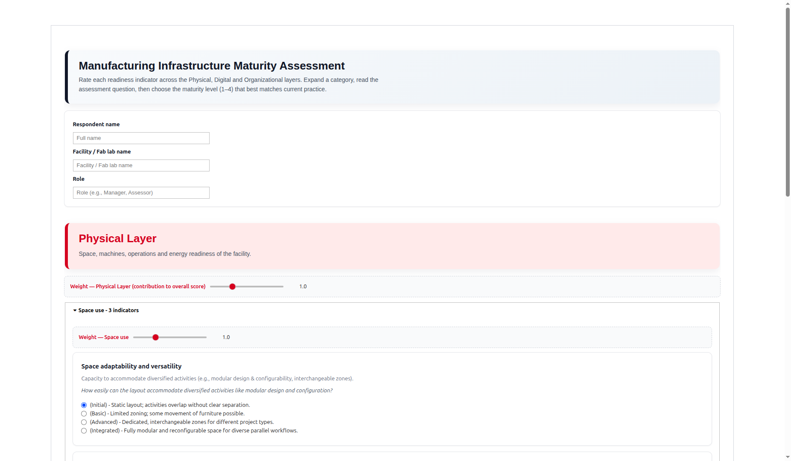

# Self-Assessment of Technical Infrastructure 
## Assessment Usage

The self-assessment evaluates a manufacturing facility’s infrastructure maturity across three layers:

- **Physical:** space, machines, operations, and energy efficiency
- **Digital:** digital tools, data management, and monitoring
- **Organizational:** governance, planning, supply chain, quality control, and knowledge management

Users enter their name, facility, and role, then expand each component and select one maturity level for every indicator:

1. Initial
2. Basic
3. Advanced
4. Integrated

The notebook calculates:

- Component scores as averages of their indicators
- Layer scores using configurable component weights
- An overall maturity score using configurable layer weights
- Radar charts for indicators, components, layers, and the overall result

After submission, it generates:

- A visual score overview
- A PDF maturity report
- A CSV file containing every indicator and selected answer

The assessment implementation is in lauds_tech-infra-read_self-assessment_questionnaire_weighted.ipynb.


## Use of Voila

Voila turns the Jupyter notebook into a browser-based application. It executes the notebook on the server but hides the code cells, exposing only the interactive widgets and generated results.

The Docker image:

- Uses Python 3.11
- Installs Voila, `ipywidgets`, Matplotlib, NumPy, Pillow, and ReportLab
- Copies the notebook into `/opt/self-assessment`
- Runs Voila on port `8050`

The configuration is defined in software/self-assessment/Dockerfile. The Voila service is currently commented out in software/container/docker-compose.yml, so it must be enabled before starting it.

Once enabled, start it with:

```sh
source .env && docker compose \
  --file software/container/docker-compose.yml \
  up -d --build voila
```

Open the assessment at:

```text
http://localhost:8050
```

Generated PDF and CSV reports are written to the container’s `/data` directory, backed by the `voila-data` Docker volume.